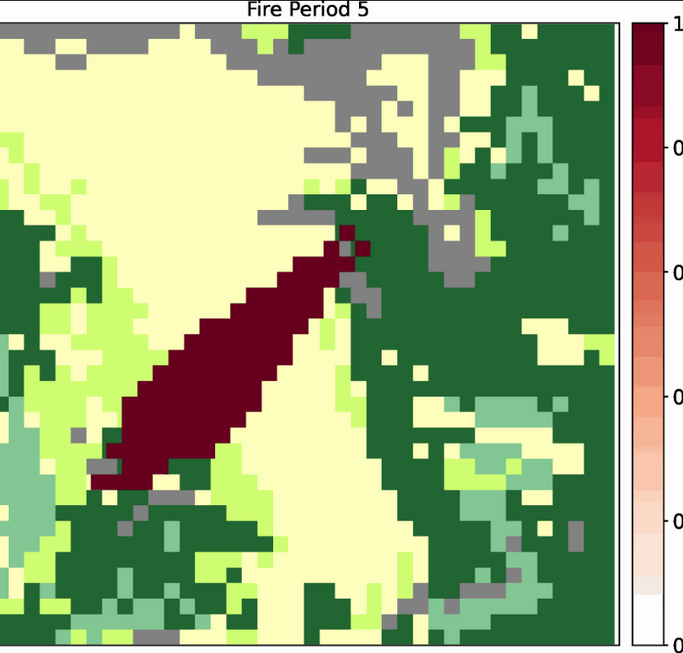

======================================
Create GIF video for Forest Fire Model
======================================

We can create a short movie of files plots and observe the trends of the images.
After running the simulator of the Cell2Fire project, we obtain several plots as outputs 
and store them in one directory. We need to find the path to this directory first. For example, if we claim the the path of 
the output images to be the following (this is where the output pictures are stored):
.. code-block:: html
   :linenos:

   cd Cell2Fire/results/Sub40x40/Plots/Plots1

Here are the specific steps about how to generate a **gif** file from the outputs. 

Steps to convert images to the form of **.gif** files:
----------------------------------------------------------------------------------
For example, The path to reach the python file **gif.py** to generate the short movie is the following:
.. code-block:: html
   :linenos:

   Cell2Fire/cell2fire/utils/gif 

  
When we run the **gif.py** file, it combines several .png files together in sequence to generate a short "movie".

The command line of generating the short movie is formed by three parts: run **gif.py** + path of the location of the pictures + path of the desired location of the output
which means the user need to call up the python file and input the location where the pictures they want to generate the short movie, and set the name of the generated output
by writing down the path to it.

Consider the location of the pictures as 

.. code-block:: html
   :linenos:

   Cell2Fire/results/Sub40x40/Plots/Plots1

In this case, we want to name the generated gif file to be **gen_output.gif** and store it in the same directory as the pictures, we have:

.. code-block:: html
  :linenos:

   Cell2Fire/results/Sub40x40/Plots/Plots1/gen_output.gif

the command line should be like the following form:

.. code-block:: html
   :linenos:

   python -m cell2fire.utils.gif Cell2Fire/results/Sub40x40/Plots/Plots1 Cell2Fire/results/Sub40x40/Plots/Plots/gen_output

We can check that in the folder and open it.

The **gif** file can be opened to see the animation.

