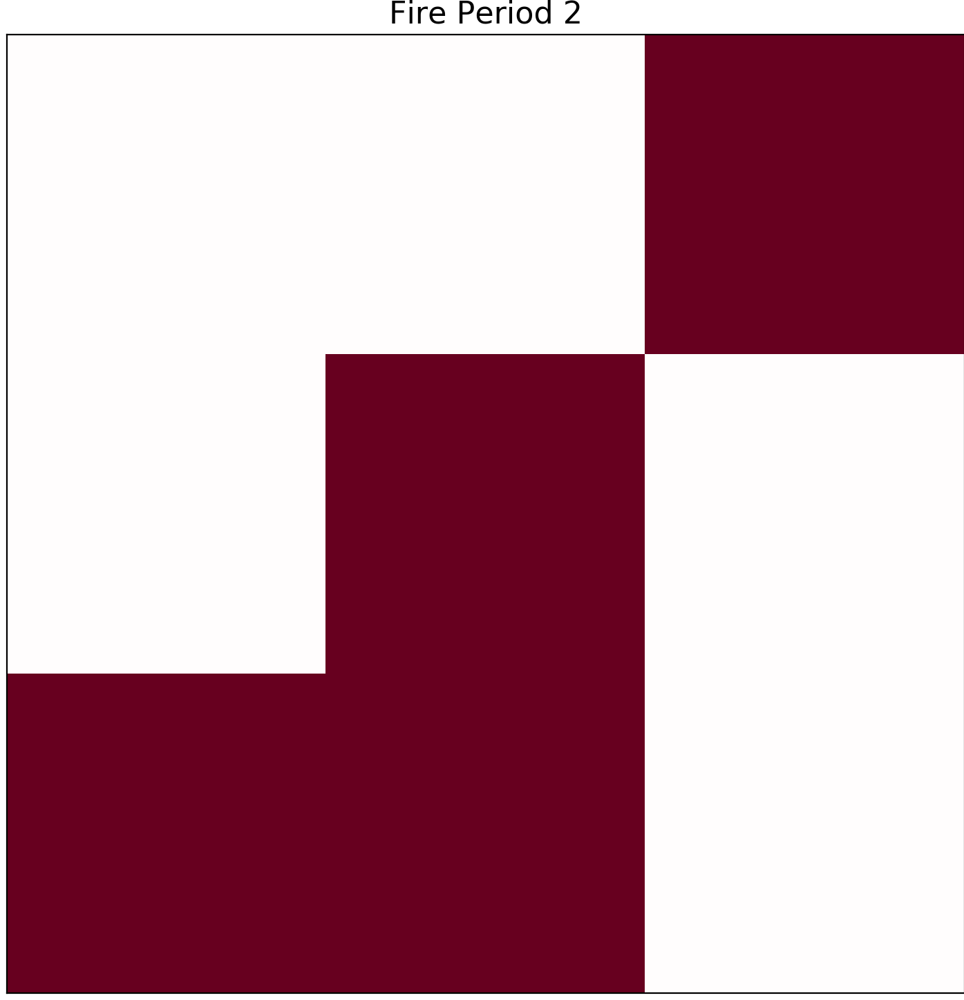
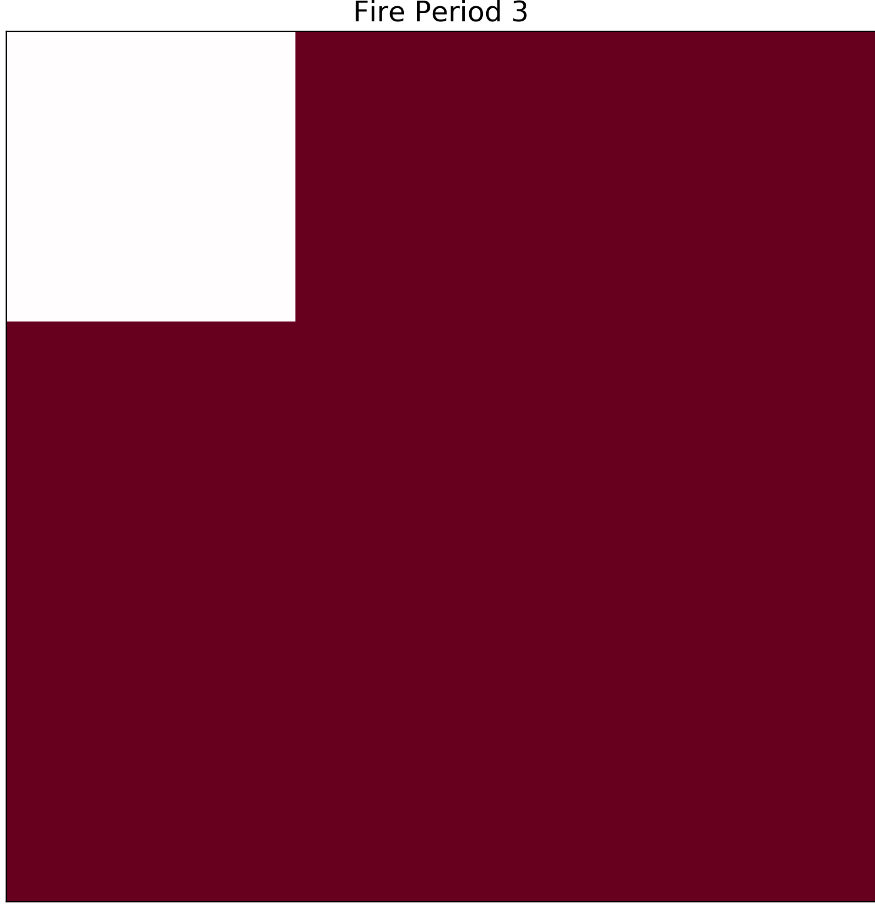

========
Examples
========

At present, this example assumes you are running on a Unix operating system.

In the contributed folder there is a folder labeled delme63.
This example uses a 9 cell forest where you are able to change weather, wind speed, etc.  This will provide you results and plots hourly of the fire propagation.

to run this simulation you will have to use the bash command from the Cell2Fire/cell2fire directory. In the command line write the following:

.. code-block:: html
   :linenos:
   
   bash ../contributed/delme63/go.bash
   
the result output will be hourly stats concluding with the
current conditions at 4 hours all 9 cells have been burned. These
stats will also be abailable in your delme63 folder. In delme63/9cellsC1/Plots
you will also get hourly plots of the fire propagation.

.. image:: ../image/Fire01.jpg
   :width: 20%

.. image:: ../image/Fire04.png
   :width: 20%
