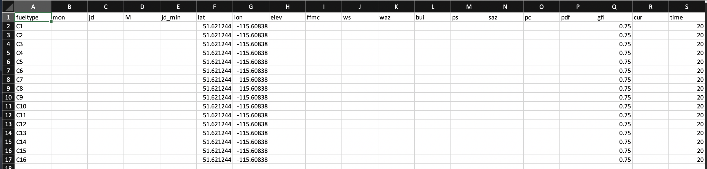
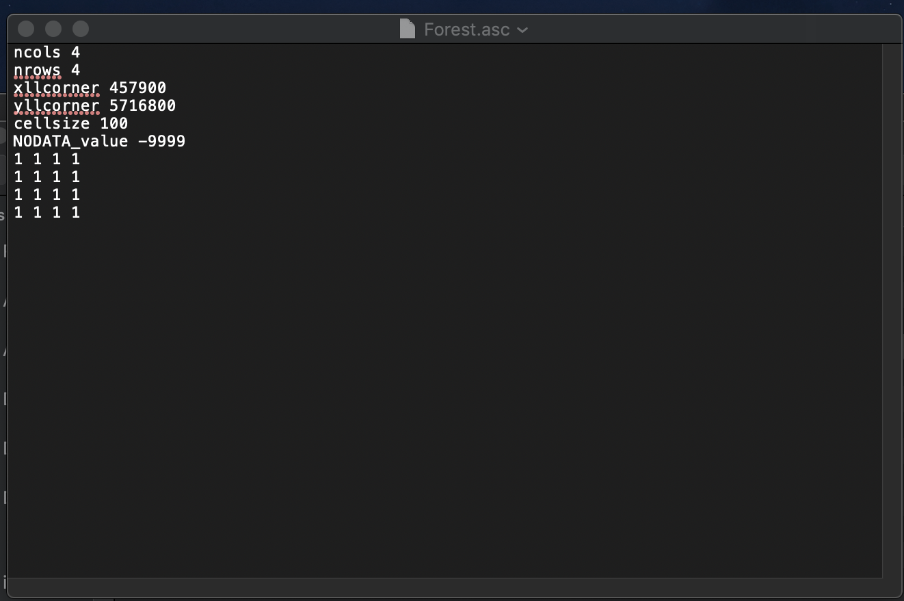
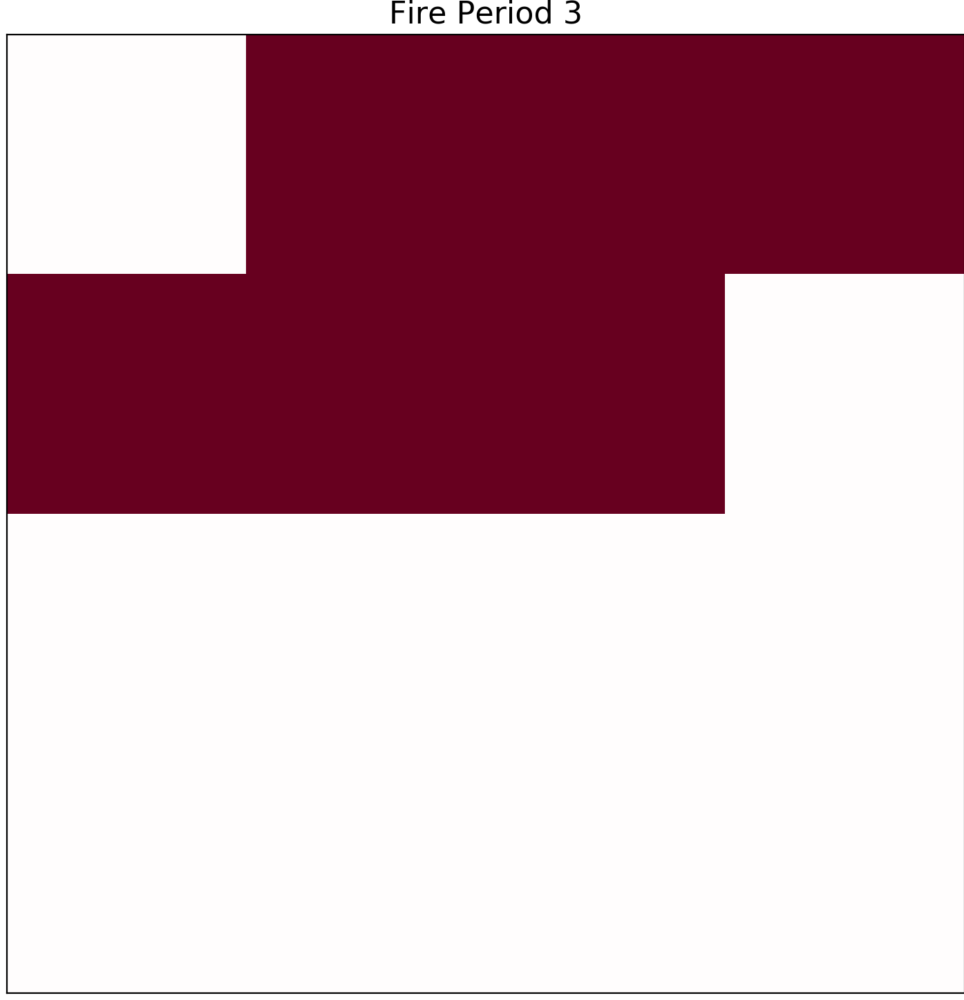
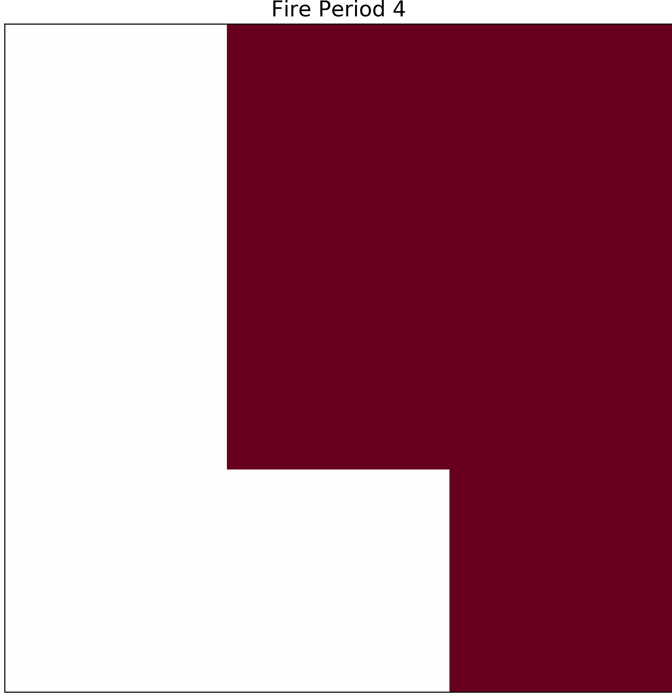

Changing the grid
=================

The Cell2Fire simulator runs on a variety of grid specifications depending on user expectations. For the flexibility of our software usage, we also provide an option to customize as per user requirements. To customize follow the steps mentioned below:

* Find your contributed folder and create a duplicate of delme63 in it.
* Change the path name so that you are in the right directory. (Look at editing Code Line section for help)

To edit the grid size first open 9cellsC1 folder. In this folder we need to first find Data.csv and Data.dat.
We can then open these files either using excel or any other reliable text editor.
Once we open these files we can notice that they have 9 data lines each. Here depending on the grid size we require, we could easily copy and paste one of the lines as many
number of times as we require to match our grid size.
We have presented an example of 16 cell as follows:

Text Editor Snapshot:

.. image:: ../image/data.png
  :width: 75%

Excel Snapshot:

To create a grid of "n columns" and "m rows" we would require equivalent number of entries as there are rows and columns.

To change cell size we first need to open Forest.asc file present in 9cellsC1 directory. Here we could input the number of rows and columns we require for our own grid.
For example to create a 16 cell grid we need to input columns as 4 and rows as 4. An illustration is presented below:

At the very end of the code we need to redesign the grid using 1's as per our requirements. Once we have made the desired changes we need to save our file and run the code to get our
desired results. The different sized grids are as below:

Image 1:

Image 2:

Do not forget to add the number of wanted cells along with respected number of rows and columns.
