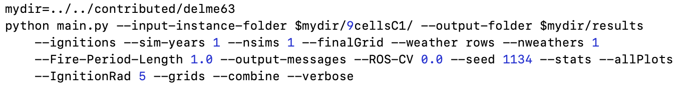
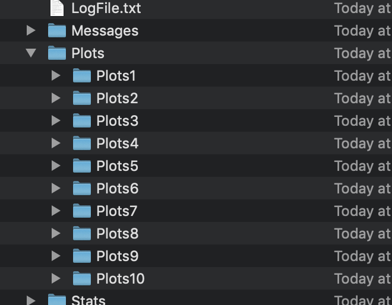

Editing Code Line
=================

To make change to the code line we first need to be in the right directory. Assuming the file is installed in **``mydirectory``** we open the following path:

.. code-block:: html
   :linenos:

   mydirectory/contributed/delme63/go.bash

Once in the right directory we can use any one of the text editing apps (Xcode, Atom etc.) to get the following code line.

The path of the working directory should be correctly edited to avoid any confusion.
We could get started by editing the following inputs:

* Number of years (Up to 4).
* Number of simulations.

Changing number of years
------------------------

In the command line you will see a section as shown below:

.. code-block:: html
   :linenos:

   --sim-years 1

Here we can enter the number of years and run the code to see the changes in output. This would help in collecting more data with varying number of years.

Number of simulations
---------------------

We can also change the number of simulations and collect data for the changes caused by number of simulation.
This can be edited in the command line as shown below:

.. code-block:: html
  :linenos:

  --nsmis #

This will give you multiple outputs depending on the number of simulations.

**If the command line had:**

.. code-block:: html
  :linenos:

  --nsmis 10

**It will result in 10 plots:**

