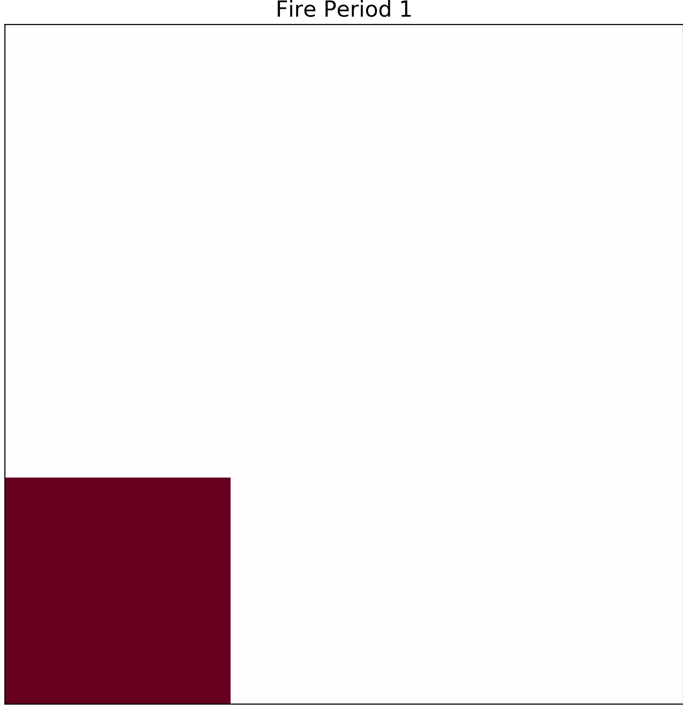
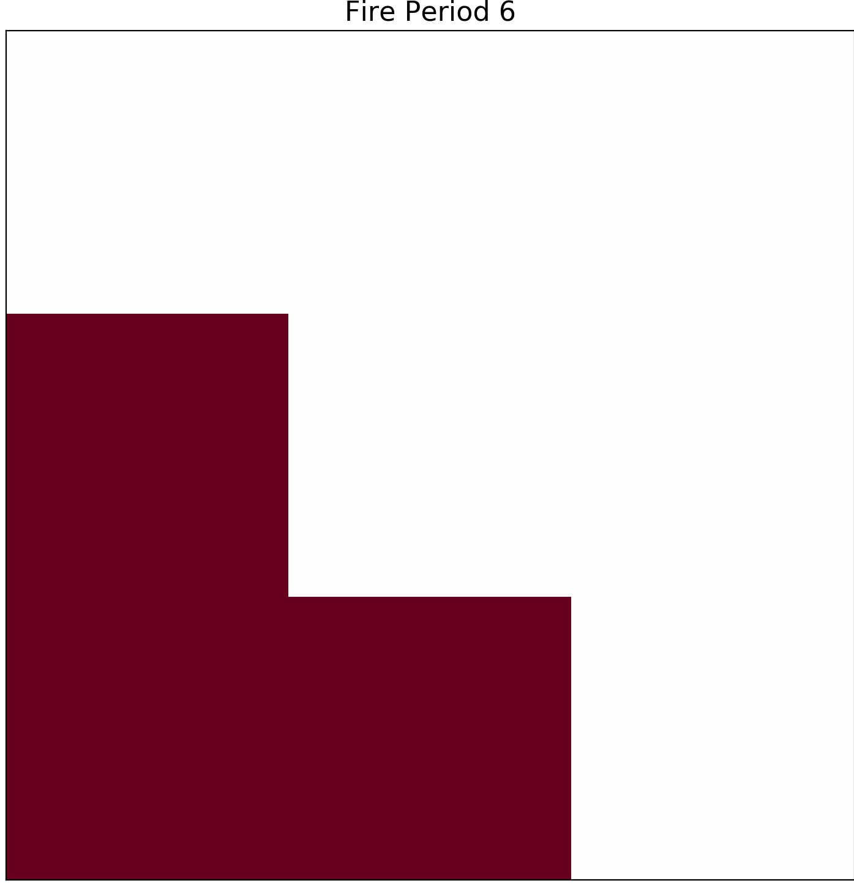
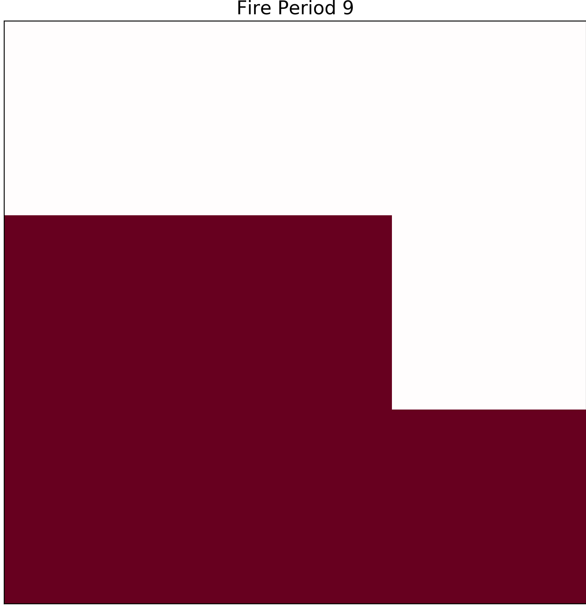
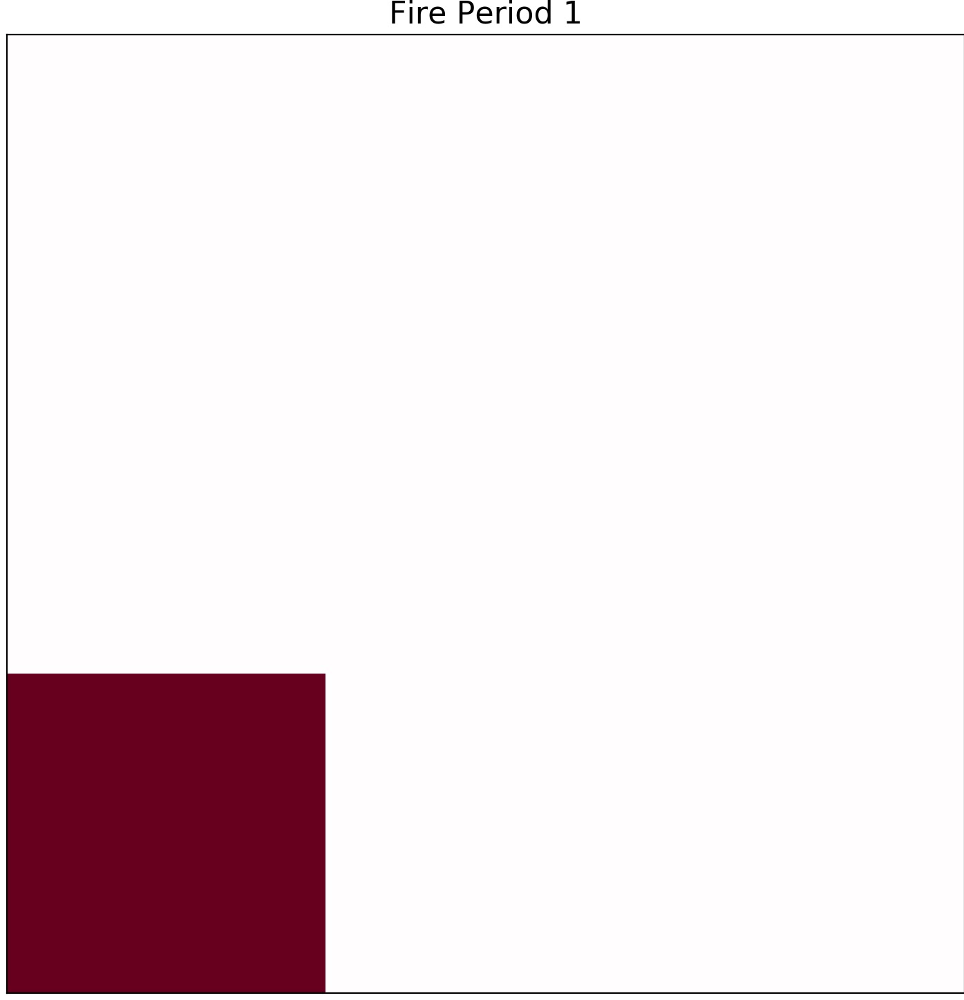
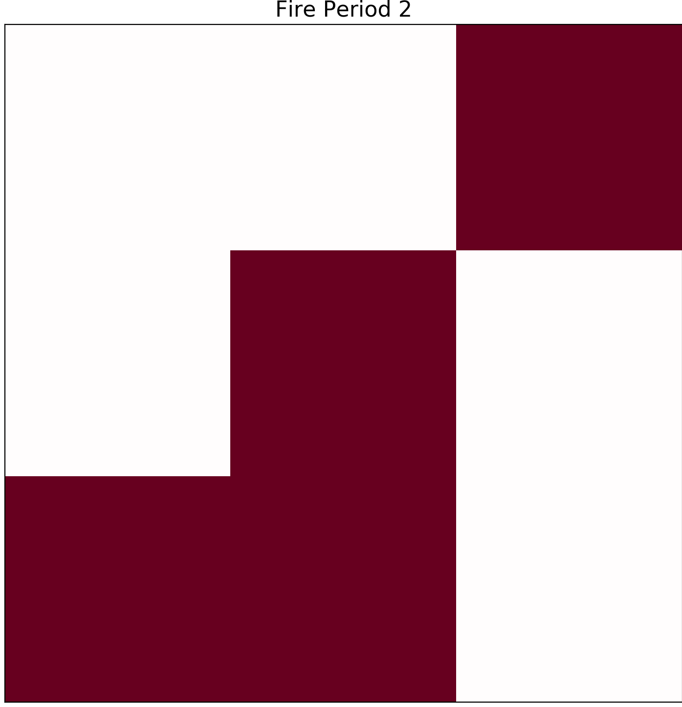
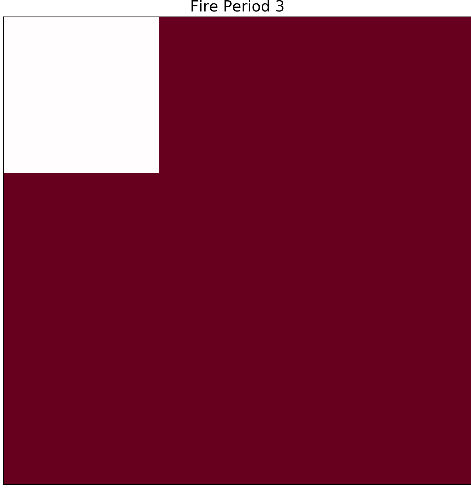
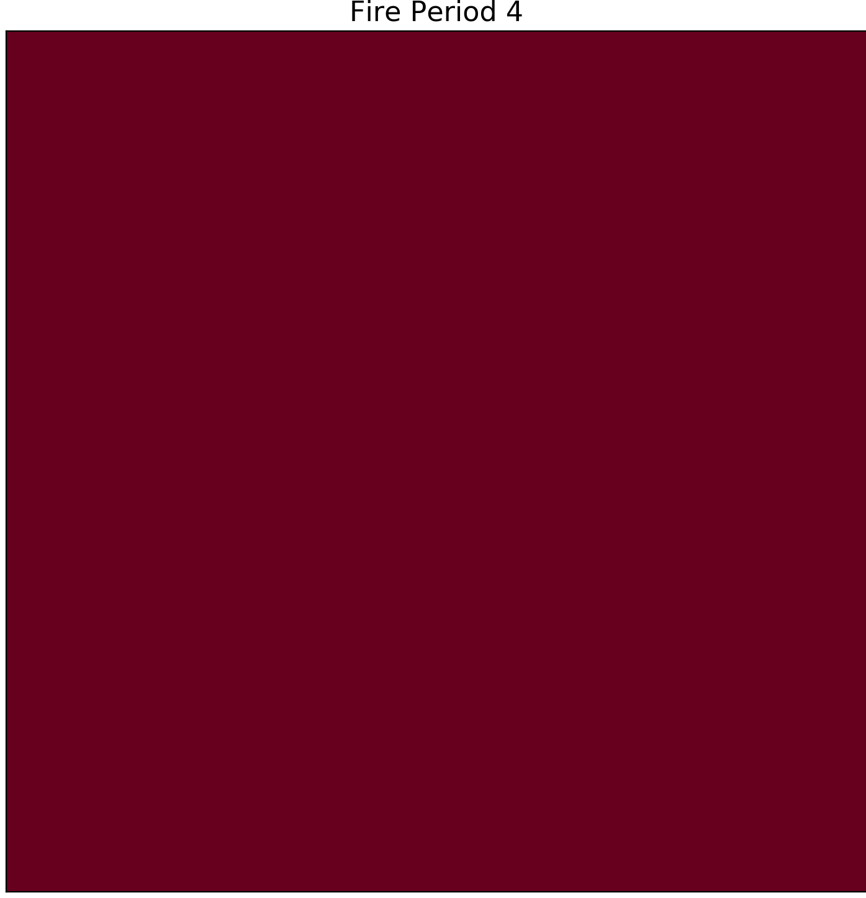
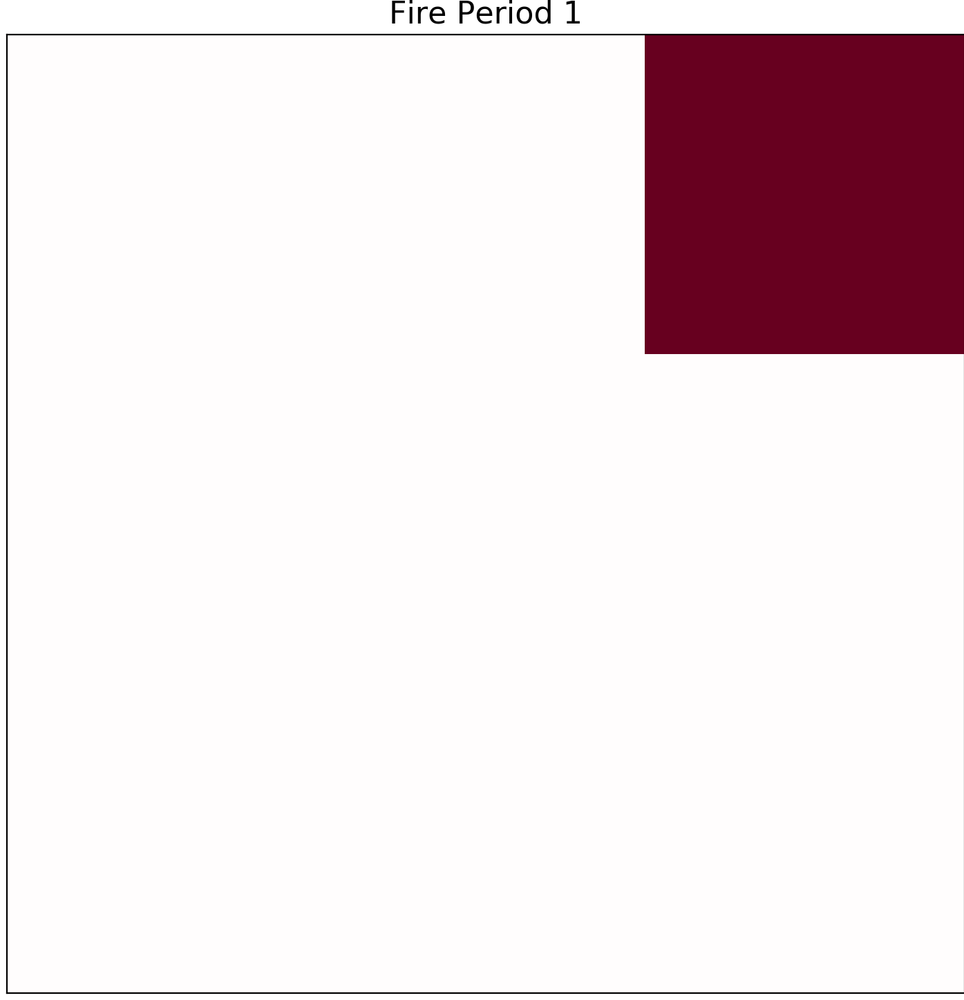
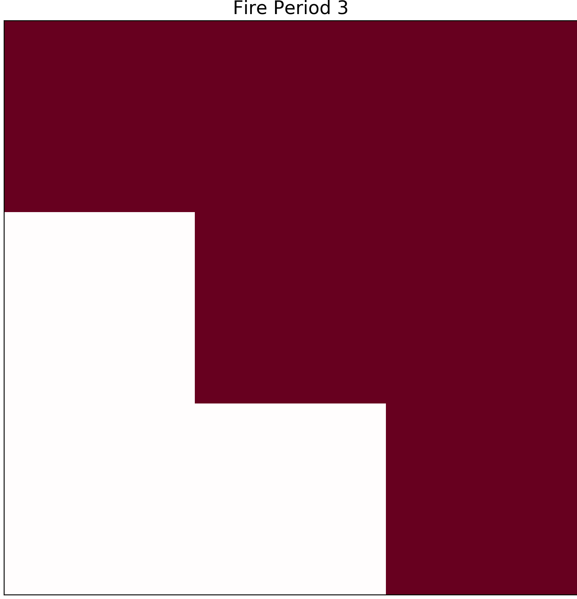
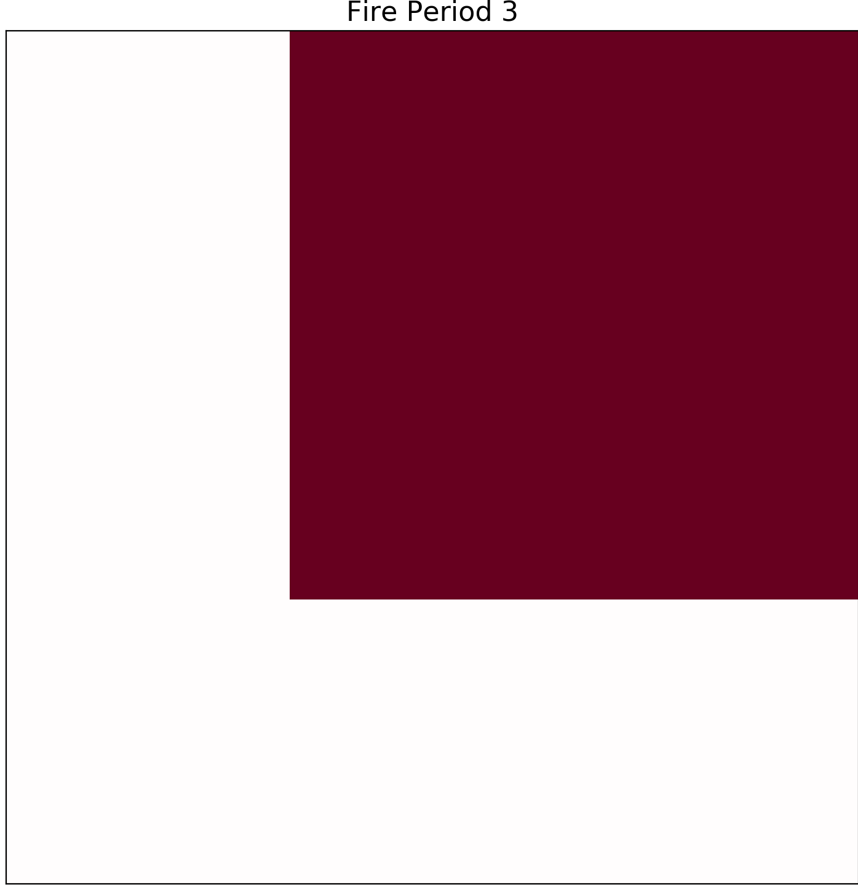

===============
Editing Weather 
===============

One of the benefits of this simulator is the ability to able to modify inputs to create different enviornments.
To modify inputs for the delme63 example, you will cd to:

.. code-block:: html
   :linenos:
   
   Cell2Fire/contributed/delme63/9cellsC1
   
From here you will find a file labeled Weather.csv which I recommened using Excel to edit.

In this file the following inputs are editable.

* Temperature [TMP] (Celcius)
* Relativity Humidity [RH]
* Wind Speed [WS] (km/hr)
* Wind Direction [WD] (degrees)
* Fine Fuel moisture Code [FFMC]
* Duff Moisture Code [DMC]
* Drought code [DC]
* Initial Spread Index [ISI]
* Buildup Index [BUI]
* Fire Weather Index [FWI]

In the case of the Buildup Index, Initial Spread Index, and Fire Weather Index these inputs use the values of the other inputs to calculate their respective scores.
It is recommended to use the equations found in *Equations for the Canadian Forest Fire Weather Index System* (Van Wagner). This paper clearly explains how generate these values using the other inputs.

Temperature & Humidity
----------------------

Temperature is measured in Celcius while relative humidity is 
measured as a percentage. Temperature affects the ignition of fires. Warmer temperatures allow for fuels to ignite and burn faster, adding to the rate at which a wildfire spreads.
When the humidity is low, meaning that there is a low amount of water vapor in the air, wildfires are more likely to start. 

Wind Speed and Direction
------------------------

Wind influences heavily how effective fires are and how fast they spread through the forest. A stronger wind signifies a more intense fire causing a wild fire to spread faster. By defult currently we have that the fire 
starts from the bottom left cell. How Wind direction works and is measured as a degree of where the wind is coming from. For example if a wind is coming from east to west it would coming from 0 degrees but wind coming from West to East would be from 180 degrees. Another quick example
would be if you want to input wind coming from NW direction then it would be between 90 and 180 degrees.

Example
-------

To show how modifying these inputs would effect the simulation we will take two different enviorments and see how fire would spread in these different scenarios.

The first set up is based on a cooler and drier climate with low Humidity with typically high wind speeds. The following inputs where used for this simulation:

* Temperature: from 1pm-5pm was 25 celcius and from 6pm-8pm was 20 celcius. Humidity kept constant at 48%
* Wind Speed: from 1pm-5pm was 23 km/h and slowed down to 6 km/h from 6pm-9pm.
* Wind Direction: Constant at 135 degrees (North Western winds) 

The second simulation is based on a area with higher temperatures, humid, and little to no wind. The following inputs where used for this simulation:

* Temperature: from 1pm-5pm was 33 celcius and from 6pm-8pm was 27 celcius. Humidity kept constant at 90%
* Wind Speed: from 1pm-5pm was 5.9 km/h and slowed down to 4 km/h from 6pm-9pm.
* Wind Direction : from 1pm-5pm winds are directed at 30 degrees, from 6pm-8pm wind are directed from 290 degrees.

In the first simulation we see that by the 8th hour that the fire has spread to all of the cells. Higher windspeeds usually influences how fast and effectively fires are able to spread.

.. figure:: ../image/Chicohr1.png
   :width: 40%  
   
   1st hour
   

      
   4th hour 
   

   
   8th hour

Notably, in the second scenario we see that fire is not able to spread to all of the cells.  This is mostly in part due to the high humidity and the low wind speeds.

   
   1st hour
   

      
   6th hour 
   

   
   9th hour

Build Up Index
--------------

The BUI is a weighted combination of the DMC and DC to indicate the total amount of fuel available for combustion by a moving flame front. The Duff Moisture Code (DMC) indicates the moisture content of loosely-compacted organic layers of moderate depth
while the Drought Code(DC) indicates moisture, content in deep, compact organic layers. The BUI scale starts at zero and is open ended, a rating above 34 is demeed high and after 77 it is considered extreme.

Editing the BUI input would change how much fuel is their is for the fire to spread from the inital cell to the next. The Following test has a low BUI value.

  

The fire is kept for a few hours in the same cell and it will never be able to proceed and burn other cells as their is no fuel for the fire.

Test 2 has an extreme BUI score and will be set at 99:

   
In Test 2 the fire has an extensive amount of fule and is able to burn all 9 cells in 4 hours. When changing BUI there is a way to calculate a typical value but it is important
to know that the DMC value has more weight when getting your value for BUI. Its also important to know that when you have a DMC value of 0 then BUI is zero. 

Initial spread Index
--------------------

The ISI combines the FFMC and wind speed to indicate the expected rate of fire spread.
Generally, a 13 km/h increase in wind speed will double the ISI value. 
The ISI is accepted as a good indicator of fire spread in open light fuel stands with wind speeds up to 40 km/h.

To explain how ISI works we will have to tests one with low winds and high a FFMC value. 

For Test 1 we have:

* Wind speed 4 km/h
* FFMC 95
* ISI is calculated to be 35.9

we get the following plots:

.. image:: ../image/ISI4.png
   :width: 23%

with these values it will take up until the 4th hour to be able to burn all of the cells. 

But knowing that a 13 km/h will double the ISI value test 2 will have values:

* Wind speed 17 km/h
* FFMC 95
* ISI is calculated to be 71.8

these inputs resulted in the following graphs:

.. image:: ../image/ISI4.png
   :width: 23%

The first image is at the end of the 1st hour and the final image is at the end of the 3rd hour so we are able to see that increasing the ISI will make the fire spread faster.

 

