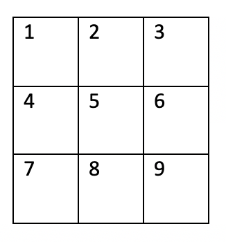
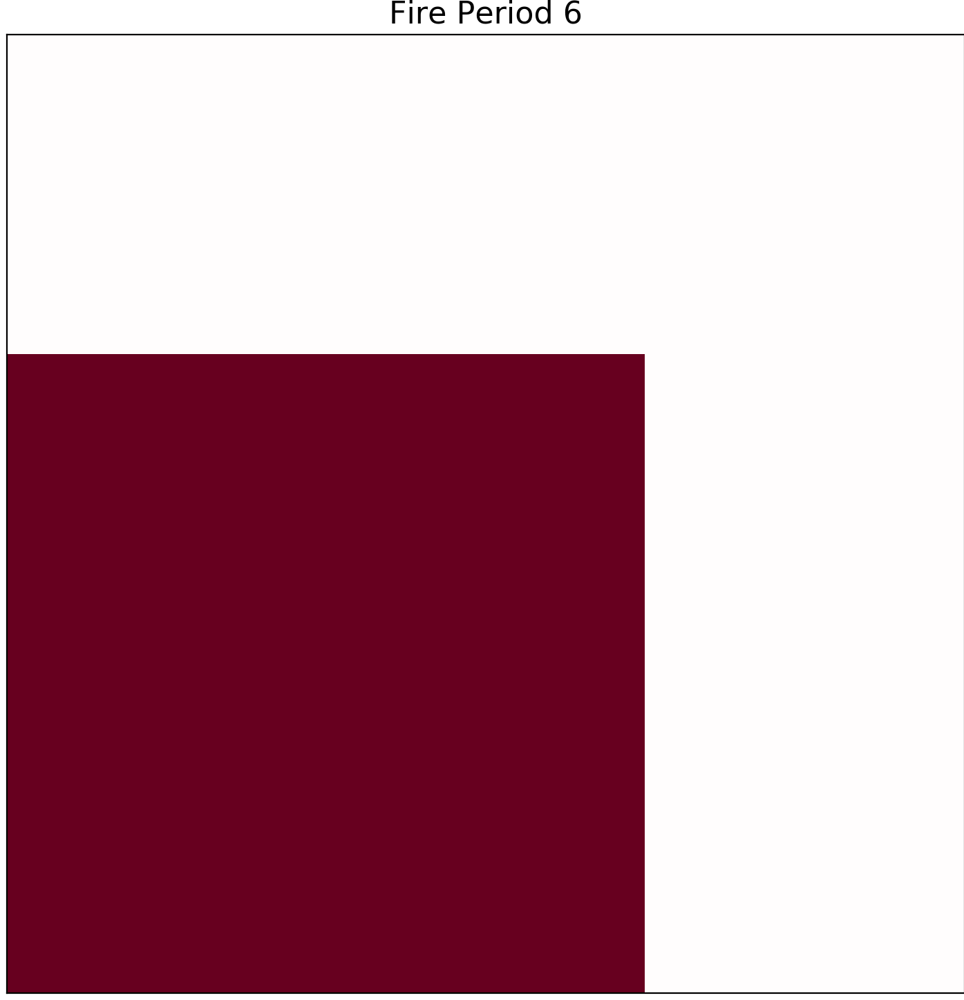
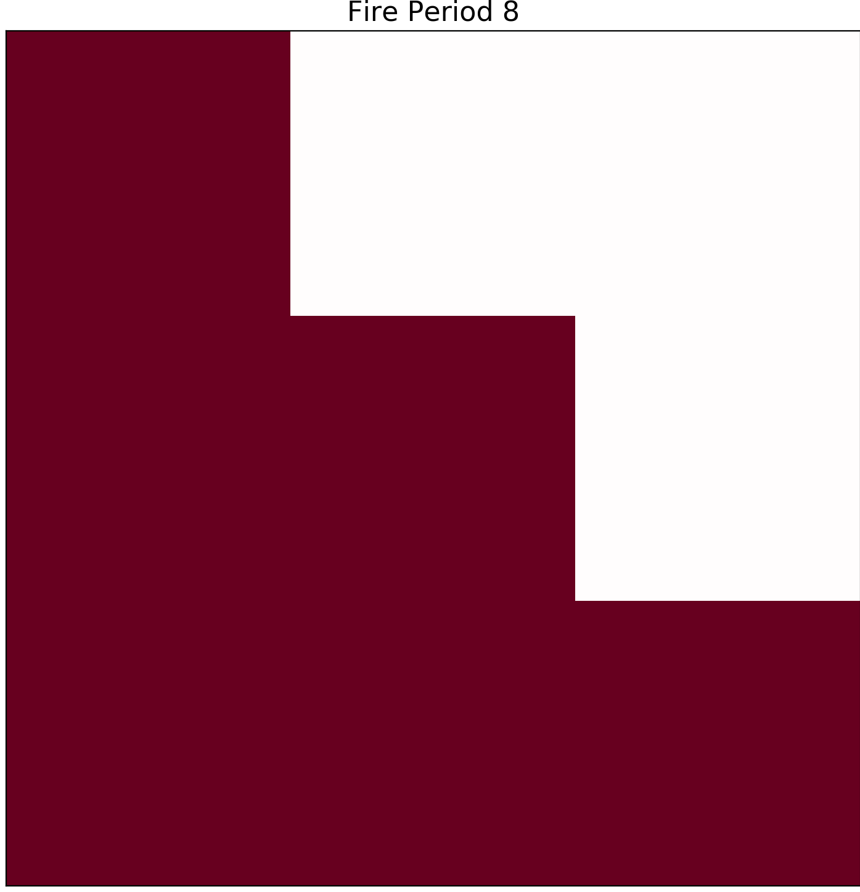
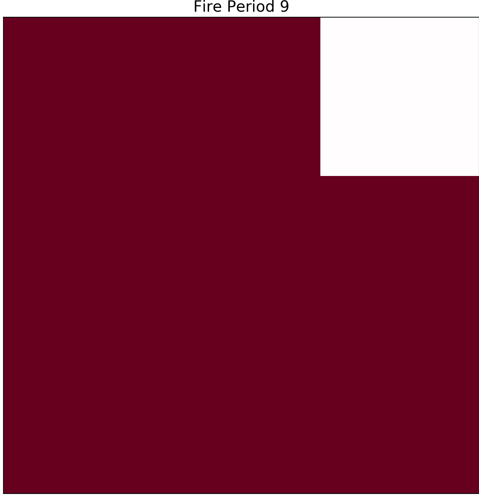
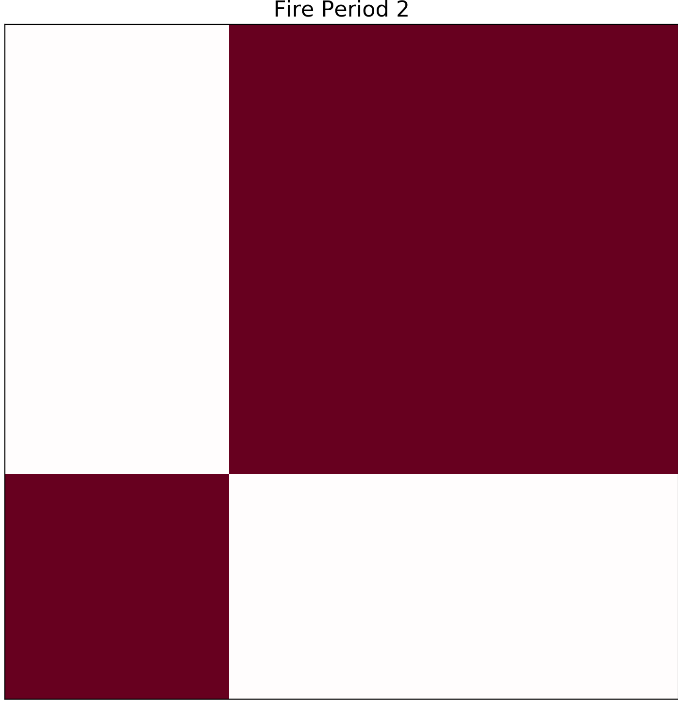
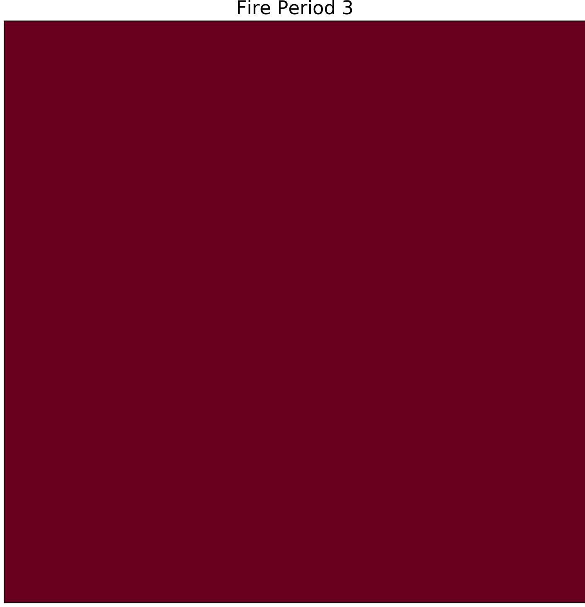

==============
Ignition Point
==============

To edit in what cell the fire will start you will have to find your Ignitions.csv file located in

.. code-block:: html
   :linenos:

   Cell2Fire/contributed/delme63/9cellsC1

You can edit this file preferably with Excell or Numbers(Mac). The numbering of the cells is the following:

It gives you the options to edit in which cell the fire would start in year 1-4.
Where the fire starts carries importance on how effective it spreads with the wind direction.

For example lets take the following cases in consideration.

Tests
-----

All test will have the following values:

* Wind speed: 25 km/h
* Wind Direction: 45 degrees (NE winds)
* All other values are kept as orginally.

What we will change is in which cell the fire starts and see how that effects the effectiveness of the fire.

In test 1 we will keep the Ignition point at its original starting cell 7.

.. image:: ../image/Fire01.jpg
   :width: 23%

In this case we see that the fire is not able to spread to all of the cells. This due to both the starting position and wind direction as it is harder for the fire to spread against the wind direction.

In Test 2 the Ignition point will be placed in cell 3:

.. image:: ../image/Ignitions/Cell31.png
   :width: 30%

In this test it only takes three hours for the fire to completely cover all the cells. When starting in cell 3 it has the benifit to be able to spread easily with the direction of the wind.
