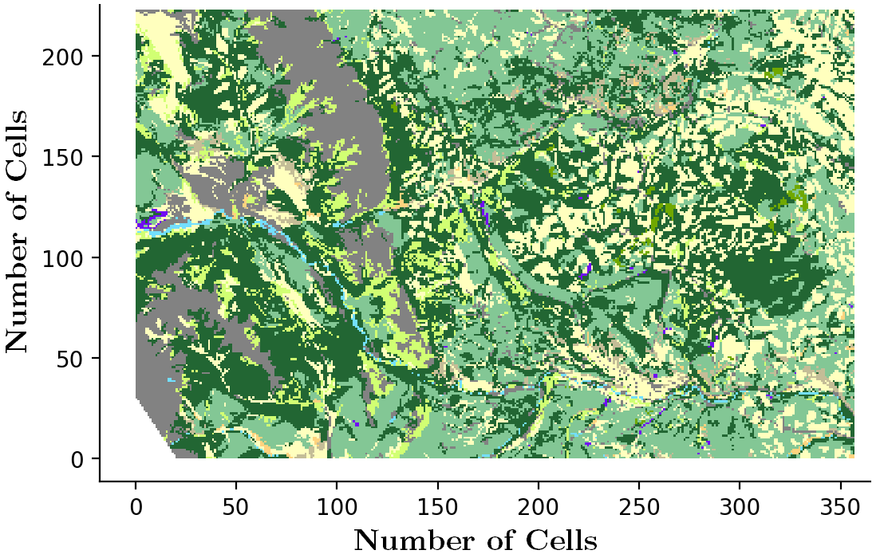
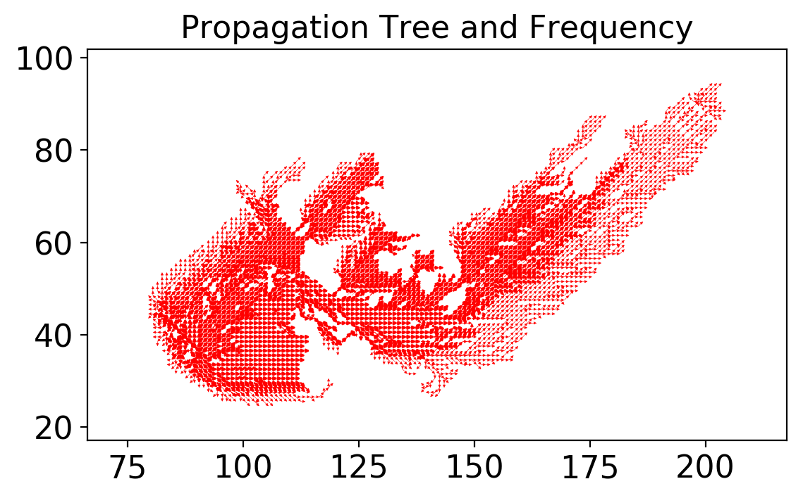
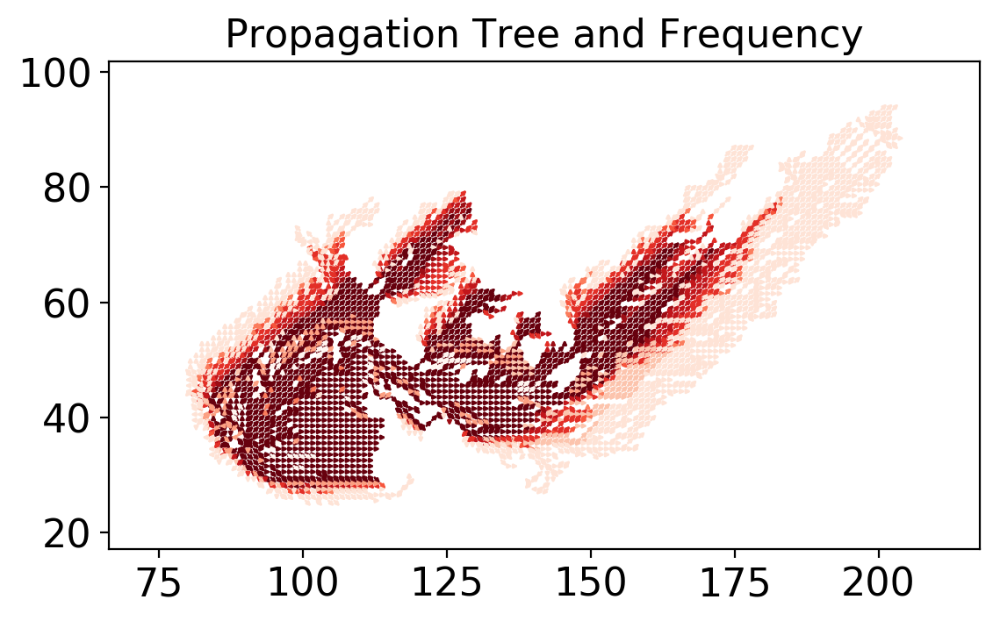
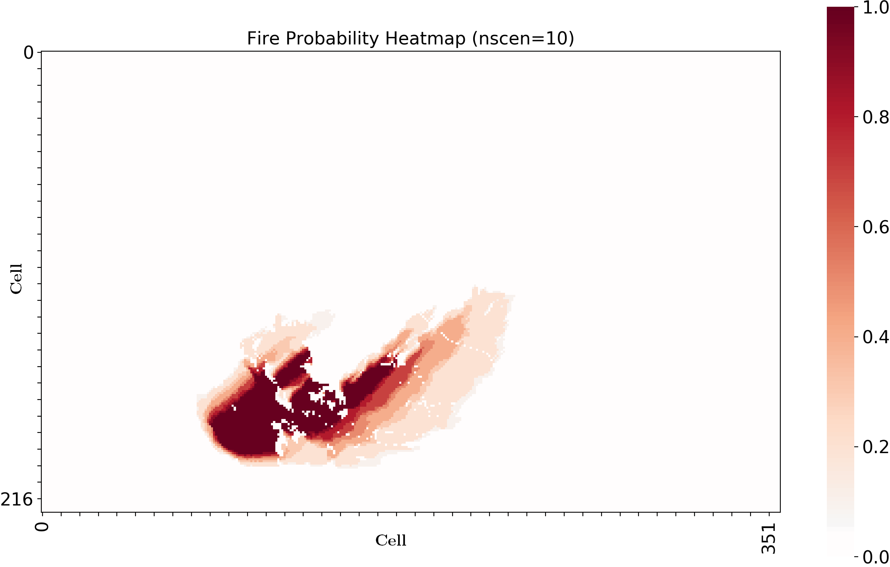

===================================
How to Get the Output Figures That Are in Readme
===================================

To get the images displayed in `Readme.md <https://github.com/cell2fire/Cell2Fire#output-examples>`__ on the GitHub page, first follow the instructions in :ref:`How to Run Simulator` on the previous page to run the fist command listed. After this is done, the four images displayed below  
will be found in the "outputs" file under their respective caption filenames by typing the following command in the terminal:

.. code-block:: html
   :linenos:

    cd ../outputs

You may then the appropriate command for your operating system to view the images. For example, on a unix machine you would type:

.. code-block:: html
   :linenos:
   
   xdg-open Example4.png

   
   Dogrib forest (Canadian instance): Example4.png

   Visualize shortest paths propagation (10 scens): Example1.png

   Shortest paths propagation and ROS intensity (10 scens): Example2.png

   
   Burn-Probability maps (10 scens): Example3.png
